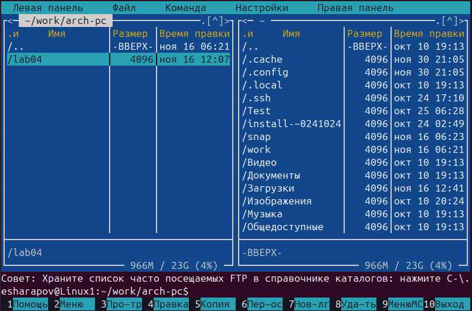
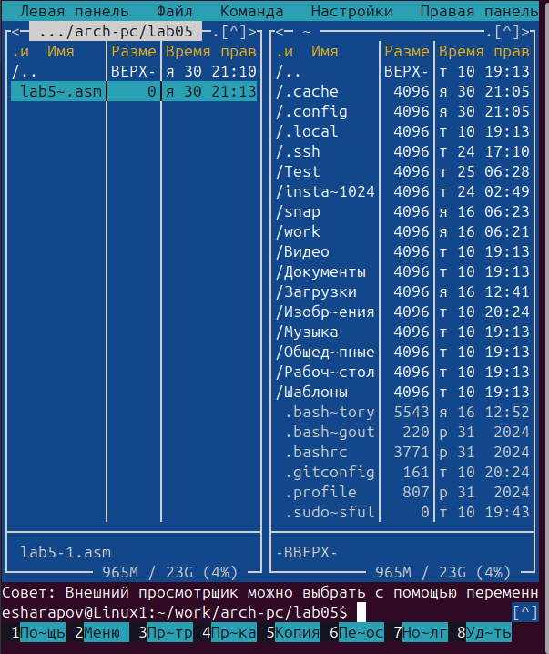
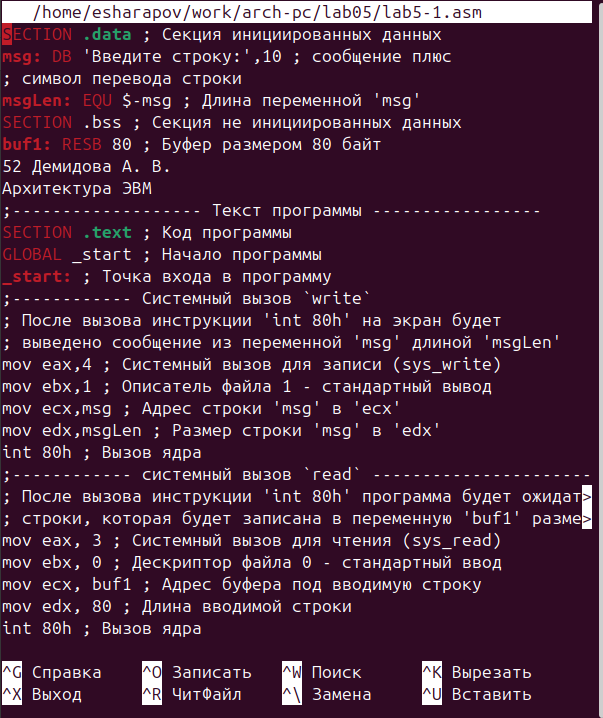
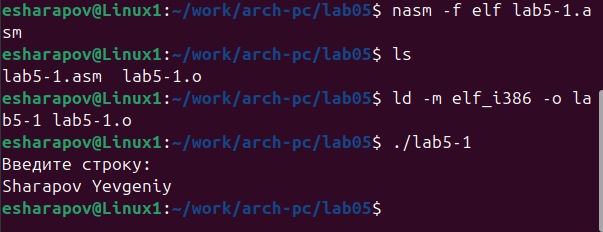
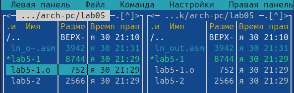
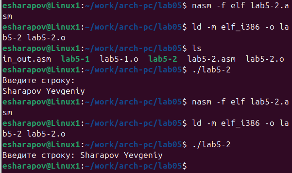
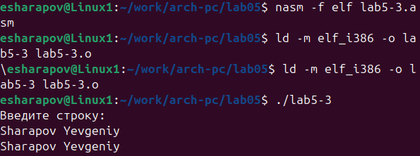
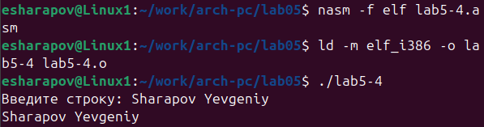

---
## Front matter
title: "Отчёт по лабораторной работе 5"
subtitle: "Структура программы на языке ассемблера NASM. Системные вызовы в ОС GNU Linux"
author: "Шарапов Евгений Артемович"

## Generic otions
lang: ru-RU
toc-title: "Содержание"

## Bibliography
bibliography: bib/cite.bib
csl: pandoc/csl/gost-r-7-0-5-2008-numeric.csl

## Pdf output format
toc: true # Table of contents
toc-depth: 2
lof: true # List of figures
lot: true # List of tables
fontsize: 12pt
linestretch: 1.5
papersize: a4
documentclass: scrreprt
## I18n polyglossia
polyglossia-lang:
  name: russian
  options:
	- spelling=modern
	- babelshorthands=true
polyglossia-otherlangs:
  name: english
## I18n babel
babel-lang: russian
babel-otherlangs: english
## Fonts
mainfont: IBM Plex Serif
romanfont: IBM Plex Serif
sansfont: IBM Plex Sans
monofont: IBM Plex Mono
mathfont: STIX Two Math
mainfontoptions: Ligatures=Common,Ligatures=TeX,Scale=0.94
romanfontoptions: Ligatures=Common,Ligatures=TeX,Scale=0.94
sansfontoptions: Ligatures=Common,Ligatures=TeX,Scale=MatchLowercase,Scale=0.94
monofontoptions: Scale=MatchLowercase,Scale=0.94,FakeStretch=0.9
mathfontoptions:
## Biblatex
biblatex: true
biblio-style: "gost-numeric"
biblatexoptions:
  - parentracker=true
  - backend=biber
  - hyperref=auto
  - language=auto
  - autolang=other*
  - citestyle=gost-numeric
## Pandoc-crossref LaTeX customization
figureTitle: "Рис."
tableTitle: "Таблица"
listingTitle: "Листинг"
lofTitle: "Список иллюстраций"
lotTitle: "Список таблиц"
lolTitle: "Листинги"
## Misc options
indent: true
header-includes:
  - \usepackage{indentfirst}
  - \usepackage{float} # keep figures where there are in the text
  - \floatplacement{figure}{H} # keep figures where there are in the text
---
1. Цель работы
2. Задание
3. Теоретическое введение
4. Выполнение лабораторной работы
5. Вывод

# Цель работы

Изучить структуру программы на языке ассемблера NASM

# Задание

1. Открыть Midnight Commander

2. Создать папку lab05 и внутри нее создать файл lab5-1.asm

3. Открыть файл  lab5-1.asm, ввести информацию из листинга 5.1 и сохранить изменения 

4. Убедится что файл содержит информацию

5. Оттранслировать текст файла lab5-1.asm, выполнить компановку объектного файла

6. Запустить файл

7. Скачать и скопировать файл in_out.asm с помощью клавиши f5

8. С помощью клавиши f6 скопировать файл lab5-1.asm с именем lab5-2.asm

9. Исправить файл lab5-2.asm в соответствии с листингом 5.2 

10. В файле lab5-2.asm заменить подпрограмму sprintLF на sprint

11. Создать исполняемый файл и проверить его работу

12. Создать копию файла lab5-1.asm и внести изменения, чтобы выводила введенная строка на экран

13. Создать копию файла lab5-2.asm и внести изменения, чтобы выводила введенная строка на экран

# Теоретическое введение

Здесь описываются теоретические аспекты, связанные с выполнением работы.

Например, в табл. [-@tbl:std-dir] приведено краткое описание стандартных каталогов Unix.

: Описание некоторых каталогов файловой системы GNU Linux {#tbl:std-dir}

| Имя каталога | Описание каталога                                                                                                          |
|--------------|----------------------------------------------------------------------------------------------------------------------------|
| `/`          | Корневая директория, содержащая всю файловую                                                                               |
| `/bin `      | Основные системные утилиты, необходимые как в однопользовательском режиме, так и при обычной работе всем пользователям     |
| `/etc`       | Общесистемные конфигурационные файлы и файлы конфигурации установленных программ                                           |
| `/home`      | Содержит домашние директории пользователей, которые, в свою очередь, содержат персональные настройки и данные пользователя |
| `/media`     | Точки монтирования для сменных носителей                                                                                   |
| `/root`      | Домашняя директория пользователя  `root`                                                                                   |
| `/tmp`       | Временные файлы                                                                                                            |
| `/usr`       | Вторичная иерархия для данных пользователя                                                                                 |

Более подробно про Unix см. в [@tanenbaum_book_modern-os_ru; @robbins_book_bash_en; @zarrelli_book_mastering-bash_en; @newham_book_learning-bash_en].

# Выполнение лабораторной работы

1. Открыть Midnight Commander (см рис 1)  
{width=100%}  
Открытый MC (рис 1)

2. Создать папку lab05 и внутри нее создать файл lab5-1.asm  (см рис 2)
{width=100%}  
Создание папки lab05 и файла lab5-1.asm (рис 2)

3. Открыть файл  lab5-1.asm, ввести информацию из листинга 5.1 и сохранить изменения (см рис 3)  
{width=100%}  
Открытый файл lab5-1.asm (рис 3)

4. Убедится что файл содержит информацию (см рис 3)  

5. Оттранслировать текст файла lab5-1.asm, выполнить компановку объектного файла (см рис 4)  
{width=100%}  
Выполнение команд (рис 4)

6. Запустить файл  (см рис 5)  
{width=100%}  
Запуск файла (рис 5)

7. Скачать и скопировать файл in_out.asm с помощью клавиши f5 (см рис 6)  
{width=100%}  
Скопированный in_out.asm через f5 (рис 6)

8. С помощью клавиши f6 скопировать файл lab5-1.asm с именем lab5-2.asm (см рис 7)  
{width=100%}  
Cкопированный файл lab5-1.asm с именем lab5-2.asm (рис 7)

9. Исправить файл lab5-2.asm в соответствии с листингом 5.2 и заменить подпрограмму sprintLF на sprint (см рис 8)   
{width=100%}  
Исправленный файл lab5-2.asm (рис 8)
10. Создать исполняемый файл и проверить его работу (см рис 9)  
{width=100%}  
Проверка и создание файла (рис 10)  
Теперь после вывода сообщения не будет перехода на новую строку

11. Создать копию файла lab5-1.asm и внести изменения, чтобы выводила введенная строка на экран (см рис 10-11)
{width=100%}

Создание копии файла lab5-1.asm  (рис 10)  
{width=120%}
Вывод введенной строки на экран (рис 11)

12. Создать копию файла lab5-2.asm и внести изменения, чтобы выводила введенная строка на экран (см рис 12-13)
{width=100%}

Создание копии файла lab5-1.asm  (рис 12)  
{width=100%}
Вывод введенной строки на экран (рис 13)

# Выводы

В процессе выполнения лабораторной работы я ознакомился со структурой программы на языке ассемблера NASM

# Список литературы{.unnumbered}

::: {#refs}
:::

# Выводы

Здесь кратко описываются итоги проделанной работы.

# Список литературы{.unnumbered}

::: {#refs}
:::
